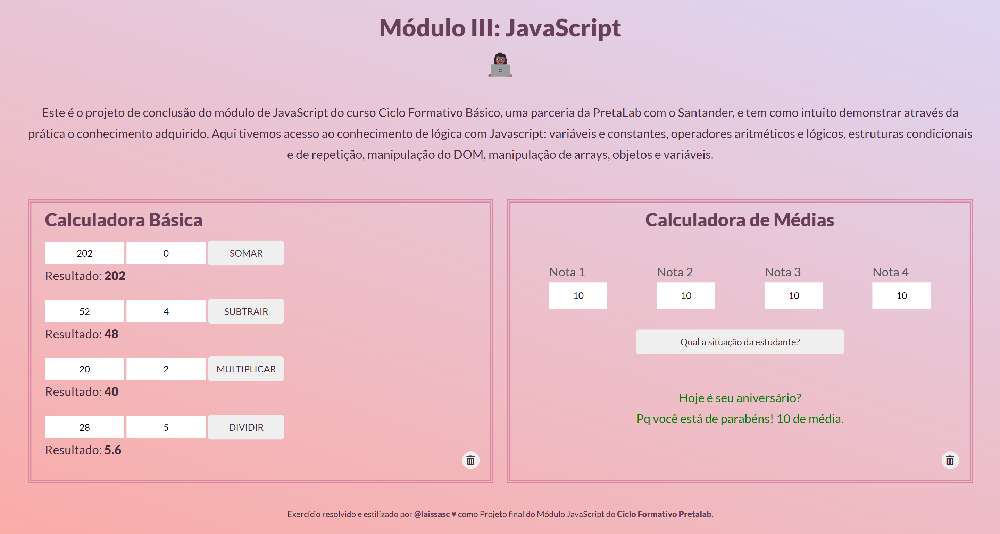
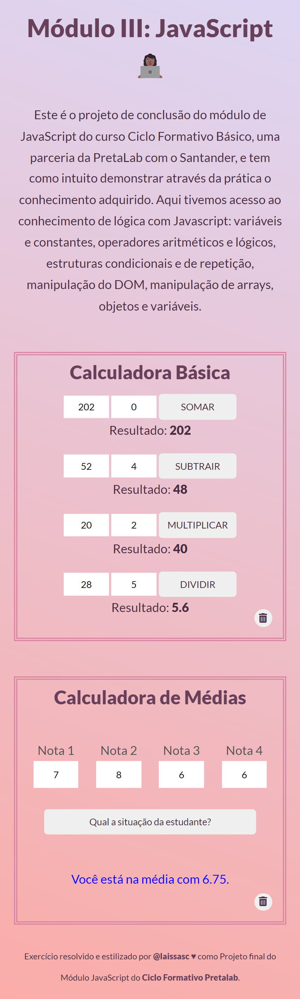

# [Ciclo Formativo Básico em Tecnologia] Projeto final do Módulo de JavaScript 👩🏾‍💻

&nbsp;
&nbsp;
&nbsp;
&nbsp;
&nbsp;
 

Professora: Ângela Carvalho

## Instruções do Projeto
Bem-vindas ao repositório do projeto final do módulo de JavaScript.

  ✅ 1. Faça um fork desse repositório.  
  ✅ 2. Abra o arquivo `calculadora.js` e siga as instruções para para que as operações básicas passem a ser funcionais. 
  ✅ 3. Abra o arquivo `media.js` e siga as instruções para para que a soma passe a ser funcional. 
  ✅ 4. [obrigatório] Por fim, publique no Netlify!

  ## Tecnologias Utilizadas
  - JavaScript;
  - HTML;
  - CSS;
  - Git;
  - GitHub
  - Netlify;

  ## Funcionalidades
  - Realiza as operações Aritméticas: soma, subtração, multiplicação e divisão e retorna o resultado;
  - Realiza o cálculo da média das 4 notas e retorna uma mensagem.
  - Realiza o reset dos dados dos inputs e resultados.

  ## Projeto Responsivo

  

  
  